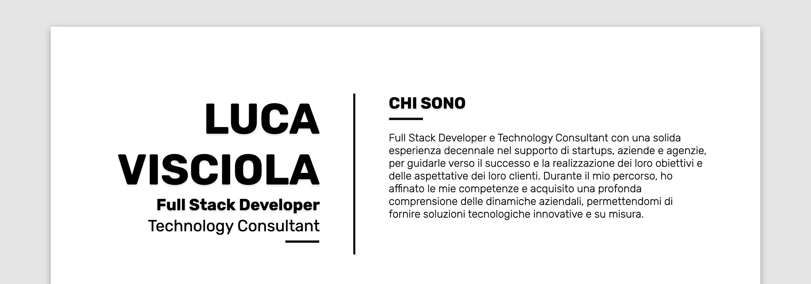

LUCA VISCIOLA
=============
### Full Stack Developer

#### Technology Consultant

* * *

<table style="border:none">
  <tr style="border: none!important;">
    <td style="border: none!important;"></td>
    <td style="border: none!important;"></td>
    <td style="border: none!important;"></td>
  </tr>
</table>

[view full resume](https://resume.lucavisciola.com)
#

### DICONO DI ME

* * *

Voglioso di cogliere ogni possibilità per migliorare le proprie conoscenze.  
Tanto deciso quanto aperto nella sua visione strategica.  
A suo agio nella gestione di situazioni critiche.

### COMPETENZE

* * *

<table>
  <tr>
    <td></td>
    <td></td>
    <td></td>
    <td></td>
    <td></td>
  </tr>
</table>

### TOOLS + UTILIZZATI

* * *

<table>
  <tr>
    <td></td>
    <td></td>
    <td></td>
    <td></td>
    <td></td>
    <td></td>
  </tr>
<tr> 
<td></td>
    <td></td>
    <td></td>
    <td></td>
    <td></td>
    <td></td>
</tr>
</table>

